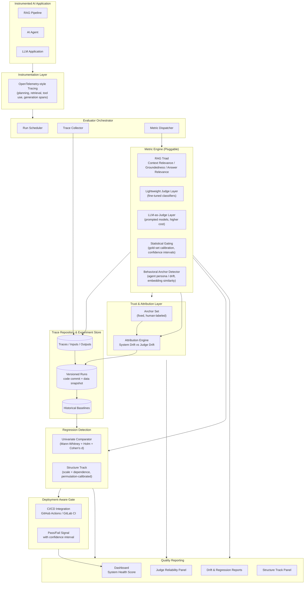

# NiriZan Architecture

This document describes the proposed system architecture for NiriZan, a continuous evaluation infrastructure for production AI systems. It translates the literature review findings and architecture research into concrete components, data flow, and design decisions.

> **Note on sourcing:** Some components below (the attribution monitor, behavioral anchor detector, and statistical gating approach) are inspired by research patterns identified during literature research and are referenced by descriptive name rather than as confirmed, individually verified citations. Treat these as design inspiration to validate against primary sources before finalizing implementation details.

---

## 1. Design Principles

NiriZan's architecture is guided by five principles, derived directly from the literature review:

1. **Probabilistic systems need statistical evaluation, not pass/fail assertions.** Every core component should produce a score with a confidence interval, not a boolean.
2. **Evaluation must not sit on the user-facing critical path.** Instrumentation and judging happen out-of-band from the application response.
3. **A quality drop can come from the system or the judge.** The architecture must be able to tell these apart.
4. **Different domains need different metrics, but one pipeline.** RAG, agents, and general LLM apps should flow through the same orchestration and tracking layer, not separate silos.
5. **Support both reference-free and reference-based evaluation.** Production monitoring favors reference-free (no ground truth available at scale); pre-deployment benchmarking favors reference-based (gold answers available).

---

## 2. High-Level System Design

---

## 3. Component Breakdown

### 3.1 Instrumentation Layer

**Purpose:** Capture what actually happened inside a RAG pipeline, agent, or LLM call, at a granular enough level to localize failures.

- Uses OpenTelemetry-style span tracing: separate spans for planning, retrieval, tool use, and generation.
- Runs as a lightweight SDK hook in the target application, not a wrapper that blocks the response path.
- **Design decision:** evaluation is decoupled from the request/response cycle. Traces are emitted asynchronously to avoid adding latency to production traffic.

### 3.2 Evaluator Orchestrator

**Purpose:** The control plane that manages the lifecycle of an evaluation run.

- **Run Scheduler:** triggers evaluation runs (on-demand, scheduled, or in response to a percentage of live production traffic).
- **Trace Collector:** ingests spans from the instrumentation layer into the Trace Repository.
- **Metric Dispatcher:** routes traces to the relevant metrics based on system type (RAG, agent, general LLM app).

### 3.3 Metric Engine (Pluggable)

This is intentionally modular so new metrics can be added without changing the orchestration layer.

| Module | What it does | When to use |
|---|---|---|
| RAG Triad | Context relevance, groundedness, answer relevance | RAG pipelines, reference-free |
| Lightweight Judge Layer | Fast, cheap fine-tuned classifiers (e.g. DeBERTa-scale) trained on synthetic in-domain pairs | High-volume production monitoring where LLM-judge cost is prohibitive |
| LLM-as-Judge Layer | Prompted larger models scoring outputs | Pre-deployment benchmarking, lower-volume evaluation, cases needing nuanced judgment |
| Statistical Gating | Calibrates lightweight judge output against a small human-labeled gold set, producing confidence intervals | Deployment gates that need a high-confidence pass/fail signal |
| Behavioral Anchor Detector | Embedding similarity between prompts/responses and labeled "aligned" vs "deviation" anchor sentences | Long-session agents, detecting persona or constraint drift |

**Design decision:** reference-free metrics (RAG Triad, anchor detection) run continuously against production traffic. Reference-based metrics (accuracy against gold answers, AgentBench-style task completion) run at pre-deployment or scheduled benchmark stages, since gold answers aren't available for live traffic.

### 3.4 Trust & Attribution Layer

**Purpose:** Answer the question "did the system get worse, or did the judge change?"

- **Anchor Set:** a small, fixed, human-labeled set of queries and expected responses, re-scored at a steady rate alongside production traffic.
- **Attribution Engine:** compares current judge behavior on the anchor set against historical judge behavior. Produces a five-state verdict: no drift, system drift, judge drift, joint drift (both system and judge shifted significantly), or inconclusive (an input distribution was empty or contained non-finite values).
- **Design decision:** this layer exists specifically because judge models (especially third-party API-based judges) can change silently, and conflating judge drift with system regression would make every other part of the pipeline untrustworthy.

### 3.5 Trace Repository & Experiment Store

**Purpose:** Source of truth for everything measured.

- Stores raw traces, inputs, intermediate retrieval steps, and final outputs.
- Every run is versioned against a specific code commit and data/prompt configuration snapshot, so any two runs are comparable.
- Maintains historical baselines used by the Regression Detector.

### 3.6 Regression Detection

**Purpose:** Detect quality drops between versions or over time.

Two complementary tracks run against the same baseline/candidate pair of score matrices:

- **Univariate track** (`regression/comparator.py`). Per-metric Mann-Whitney U with Holm-Bonferroni correction and Cohen's d effect gating. This is the primary decision signal and the only track that has historically driven the deployment gate. It is one-sided (fires only on degradation, not improvement) and its verdicts carry a signed effect size.
- **Structure track** (`regression/multivariate.py`). Two permutation-calibrated tests targeting changes the univariate track is blind to, per the internal N=3000 ablation study:
  - `scale`: variance-only change, computed as a permutation test on the sum of squared log-variance ratios across metrics. The univariate track fires on this at roughly its nominal false-alarm rate (2.3%), i.e. it has no power to detect it.
  - `dependence`: rank-correlation change, computed as a permutation-calibrated maxT of the off-diagonal differences between the two groups' rank-correlation matrices. A pure copula shift leaves every marginal unchanged, so the univariate track has no information about it by construction. Rank correlation is used rather than covariance Frobenius specifically because the ablation showed covariance Frobenius leaks variance changes into the dependence test.

  The two structure tests are combined with Holm-Bonferroni at the structure track's alpha, and both are inherently **undirected** — a variance increase and a variance decrease of equal magnitude produce the same test statistic.

- **Regime handling.** Below `min_complete_rows` complete cases, or with a zero-variance metric column, the structure track emits an `INCONCLUSIVE` verdict rather than a silent pass, mirroring the `AttributionVerdict.INCONCLUSIVE` contract in the Trust layer.

- Feeds both the deployment gate (blocking, subject to mode limits below) and the reporting layer (informational).

### 3.7 Deployment-Aware Gate

**Purpose:** Let evaluation results actually block or approve a release, not just report on it after the fact.

- Integrates with CI/CD (GitHub Actions, GitLab CI, or similar) as a build step.
- Emits a pass/fail signal with an attached confidence interval, not just a raw score, so teams can set risk-appropriate thresholds.
- **Two-track authority.** `GateVerdict.multivariate_verdicts` carries the structure track's verdicts alongside `regression_verdicts` (the univariate track). `passed` flips to `False` on any `BLOCKING` verdict from either track. Structure verdicts do not participate in `select_decision_metric`, which is univariate-only by design.
- **Structure track mode caps its authority.** The structure track runs in one of two modes (see `MultivariateConfig.mode`):
  - `BALANCED` (default): the structure track may raise `WARNING`, never `BLOCKING`. `GateVerdict.passed` is never flipped by a structure verdict in this mode. The reason is directionality: a variance change that is an improvement and one that is a regression produce the same test statistic, so a BLOCKING structure verdict would fail a release on a change that might be desirable. WARNING severity surfaces the signal to a human without gating on it automatically.
  - `STRICT` (opt-in): the structure track may raise `BLOCKING`. The caller is responsible for carving the structure track's alpha out of the same budget the univariate comparator spends, because the ablation showed that any second block-capable track inflates the gate's worst-configuration false-alarm rate above the nominal 5% unless the alpha is shared.

### 3.8 Quality Reporting

**Purpose:** Make results visible and actionable for engineering teams.

- **System Health Score:** an aggregated view combining retrieval relevance, agent plan quality, and drift signals into one summary metric, inspired by aggregation approaches used in tools like Deepchecks.
- **Judge Reliability Panel:** tracks judge consistency and bias longitudinally, as a first-class, dashboarded metric rather than an afterthought.
- **Drift & Regression Reports:** surfaces what changed, when, and whether it was attributed to the system or the judge.
- **Structure Track Panel:** surfaces the multivariate structure verdicts alongside the univariate verdicts in `DashboardSnapshot.multivariate_verdicts`. Structure verdicts are reported as informational context and deliberately **do not participate in the numeric health score**: a directionless signal cannot honestly be reduced to a scalar degradation value, and folding it in would either require picking a direction (wrong, since the tests are undirected) or double-counting univariate signals that already flow into the score.

---

## 4. Key Architectural Tensions and How NiriZan Resolves Them

| Tension | Positions in the literature | NiriZan's approach |
|---|---|---|
| Reference-free vs. reference-based evaluation | RAGAS/TruLens favor reference-free; AgentBench/HELM rely on gold references | Support both: reference-free for continuous production monitoring, reference-based for pre-deployment benchmarking |
| Static vs. living benchmarks | Static benchmarks risk data leakage and memorization; some proposals favor continuously refreshed evaluation sets | Support living data pipelines so benchmark data can be refreshed rather than going stale |
| Judge agreement metrics | Raw exact-match agreement overstates judge quality; Cohen's kappa is a more honest metric; position bias affects even strong models | Track judge reliability (including bias and consistency) as its own longitudinal metric, not just a one-time validation step |
| Cost vs. accuracy of judging | LLM-as-judge is accurate but expensive at scale; lightweight classifiers are cheap but need calibration | Use lightweight judges for volume, calibrate against a small gold set with statistical gating, reserve LLM-as-judge for lower-volume, higher-stakes evaluation |
| Directed vs. undirected regression signals | Per-metric tests are one-sided and carry a direction; structure tests (variance, dependence) are undirected | Keep both tracks, but cap the structure track at `WARNING` in the default `BALANCED` mode so an undirected signal never blocks a release automatically |

---

## 5. Identified Gaps NiriZan Aims to Fill

1. **Unified RAG + agent + drift pipeline.** Most existing tools specialize in one domain; NiriZan aggregates retrieval quality, agent behavior, and drift into a single pipeline and health score.
2. **Judge-reliability tracking as a first-class, dashboarded metric**, not a one-off audit.
3. **Integrity-checked evaluation.** Guard against benchmark gaming (e.g. an agent reading reference answers directly rather than solving the task) through integrity-checking analysis modules.
4. **Data freshness and ownership signals.** A RAG system can score well on faithfulness while still answering from stale or unowned data; NiriZan should track data freshness/ownership metadata alongside inference-layer scores.
5. **Structure-aware regression detection.** The univariate ablation study showed that per-metric tests are blind to variance-only and dependence-only degradations at the FAR-eligible operating point. NiriZan's structure track exists specifically to cover those two cases, and only those two cases, without reopening the false-alarm budget the univariate track already spends.

---

## 6. Summary Table for Design Doc Reference

| NiriZan Component | Inspiration | Problem Solved |
|---|---|---|
| Evaluator Orchestrator | AgentBench-style multi-environment testing | Coordinating multi-turn, multi-domain evaluation runs |
| Statistical Gating | Prediction-powered inference (PPI) style calibration | High-confidence regression gating at low cost |
| Attribution Engine | Judge-vs-system drift attribution research | Disambiguating whether a score drop is the system or the judge |
| Behavioral Anchor Detector | Embedding-based persona/behavior monitoring | Real-time agent drift detection, cheap enough for continuous use |
| Holistic Reporter | HELM's multi-metric, multi-scenario visibility model | Giving teams one place to see overall AI system quality |
| Structure Track | Internal N=3000 ablation of the multivariate structure tests | Detecting variance-only and dependence-only degradation that univariate tests miss, without reopening the false-alarm budget |