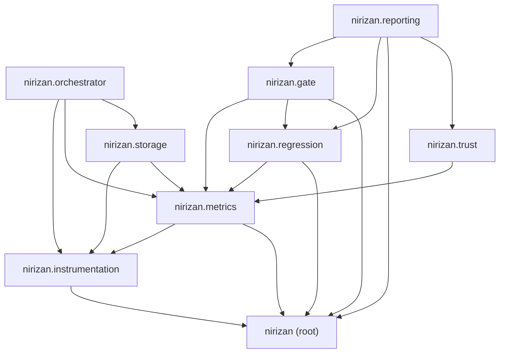

# Dependency Graph (generated)

> Generated by `.github/scripts/gen_dependency_graph.py` via the
> `dependency-graph` GitHub Actions workflow (manual trigger only).
> The generator reads only `src/nirizan/*.py`, `src/nirizan/*/*.py`,
> and this file, and writes only this file. Do not hand-edit; changes
> will be overwritten the next time the workflow runs.

## Layer-level diagram

## File-level imports

| Module | File | Imports (in-package) |
|---|---|---|
| `nirizan` | `src/nirizan/__init__.py` | `nirizan._logging` |
| `nirizan._logging` | `src/nirizan/_logging.py` | _none_ |
| `nirizan.gate` | `src/nirizan/gate/__init__.py` | `nirizan.gate.verdict` |
| `nirizan.gate.ci` | `src/nirizan/gate/ci.py` | `nirizan._logging`, `nirizan.gate.verdict` |
| `nirizan.gate.verdict` | `src/nirizan/gate/verdict.py` | `nirizan._logging`, `nirizan.metrics.stats`, `nirizan.regression.comparator` |
| `nirizan.instrumentation` | `src/nirizan/instrumentation/__init__.py` | _none_ |
| `nirizan.instrumentation.exporters` | `src/nirizan/instrumentation/exporters.py` | `nirizan.instrumentation.spans` |
| `nirizan.instrumentation.sdk` | `src/nirizan/instrumentation/sdk.py` | `nirizan._logging`, `nirizan.instrumentation.exporters`, `nirizan.instrumentation.spans`, `nirizan.instrumentation.tracer` |
| `nirizan.instrumentation.sessions` | `src/nirizan/instrumentation/sessions.py` | _none_ |
| `nirizan.instrumentation.spans` | `src/nirizan/instrumentation/spans.py` | _none_ |
| `nirizan.instrumentation.tracer` | `src/nirizan/instrumentation/tracer.py` | `nirizan.instrumentation.exporters`, `nirizan.instrumentation.spans` |
| `nirizan.metrics` | `src/nirizan/metrics/__init__.py` | `nirizan.metrics.statistical_gating`, `nirizan.metrics.stats` |
| `nirizan.metrics.base` | `src/nirizan/metrics/base.py` | `nirizan.instrumentation.spans` |
| `nirizan.metrics.behavioral_anchor` | `src/nirizan/metrics/behavioral_anchor.py` | `nirizan.instrumentation.spans`, `nirizan.metrics.base` |
| `nirizan.metrics.lightweight_judge` | `src/nirizan/metrics/lightweight_judge.py` | `nirizan._logging`, `nirizan.metrics.base` |
| `nirizan.metrics.llm_judge` | `src/nirizan/metrics/llm_judge.py` | `nirizan._logging`, `nirizan.metrics.base` |
| `nirizan.metrics.rag_triad` | `src/nirizan/metrics/rag_triad.py` | `nirizan._logging`, `nirizan.instrumentation.spans`, `nirizan.metrics.base` |
| `nirizan.metrics.statistical_gating` | `src/nirizan/metrics/statistical_gating.py` | `nirizan._logging`, `nirizan.metrics.stats` |
| `nirizan.metrics.stats` | `src/nirizan/metrics/stats.py` | `nirizan._logging` |
| `nirizan.orchestrator` | `src/nirizan/orchestrator/__init__.py` | _none_ |
| `nirizan.orchestrator.collector` | `src/nirizan/orchestrator/collector.py` | `nirizan.instrumentation.exporters`, `nirizan.instrumentation.spans` |
| `nirizan.orchestrator.dispatcher` | `src/nirizan/orchestrator/dispatcher.py` | `nirizan.instrumentation.spans`, `nirizan.metrics.base` |
| `nirizan.orchestrator.scheduler` | `src/nirizan/orchestrator/scheduler.py` | `nirizan.instrumentation.spans`, `nirizan.orchestrator.dispatcher`, `nirizan.storage.models` |
| `nirizan.regression` | `src/nirizan/regression/__init__.py` | `nirizan.regression.comparator` |
| `nirizan.regression.comparator` | `src/nirizan/regression/comparator.py` | `nirizan._logging`, `nirizan.regression.thresholds` |
| `nirizan.regression.thresholds` | `src/nirizan/regression/thresholds.py` | `nirizan._logging`, `nirizan.metrics.stats` |
| `nirizan.reporting` | `src/nirizan/reporting/__init__.py` | _none_ |
| `nirizan.reporting.dashboard` | `src/nirizan/reporting/dashboard.py` | `nirizan._logging`, `nirizan.gate.verdict`, `nirizan.regression.comparator`, `nirizan.reporting.health_score`, `nirizan.reporting.judge_reliability`, `nirizan.trust.attribution` |
| `nirizan.reporting.health_score` | `src/nirizan/reporting/health_score.py` | `nirizan.trust.attribution` |
| `nirizan.reporting.judge_reliability` | `src/nirizan/reporting/judge_reliability.py` | `nirizan._logging`, `nirizan.trust.attribution` |
| `nirizan.storage` | `src/nirizan/storage/__init__.py` | _none_ |
| `nirizan.storage.baselines` | `src/nirizan/storage/baselines.py` | `nirizan.storage.models` |
| `nirizan.storage.experiment_store` | `src/nirizan/storage/experiment_store.py` | `nirizan.storage.models` |
| `nirizan.storage.models` | `src/nirizan/storage/models.py` | `nirizan.instrumentation.spans`, `nirizan.metrics.base` |
| `nirizan.storage.run_repository` | `src/nirizan/storage/run_repository.py` | `nirizan.storage.models` |
| `nirizan.storage.session_repository` | `src/nirizan/storage/session_repository.py` | `nirizan.instrumentation.sessions` |
| `nirizan.storage.trace_repository` | `src/nirizan/storage/trace_repository.py` | `nirizan.instrumentation.spans`, `nirizan.storage.models` |
| `nirizan.trust` | `src/nirizan/trust/__init__.py` | _none_ |
| `nirizan.trust.anchor_set` | `src/nirizan/trust/anchor_set.py` | _none_ |
| `nirizan.trust.attribution` | `src/nirizan/trust/attribution.py` | `nirizan.metrics.stats` |

## Possibly-unused exports

| Module | Exported name | Imported elsewhere? |
|---|---|---|
| `nirizan` | `__version__` | no (via `from ... import`) |
| `nirizan` | `disable_logging` | no (via `from ... import`) |
| `nirizan` | `enable_logging` | no (via `from ... import`) |
| `nirizan` | `get_logger` | no (via `from ... import`) |
| `nirizan` | `set_log_level` | no (via `from ... import`) |
| `nirizan._logging` | `NiriZanFormatter` | no (via `from ... import`) |
| `nirizan.gate` | `GateVerdict` | no (via `from ... import`) |
| `nirizan.gate` | `evaluate_gate` | no (via `from ... import`) |
| `nirizan.gate` | `select_decision_metric` | no (via `from ... import`) |
| `nirizan.gate.ci` | `format_gate_summary` | no (via `from ... import`) |
| `nirizan.gate.ci` | `gate_exit_code` | no (via `from ... import`) |
| `nirizan.gate.ci` | `serialize_gate_verdict` | no (via `from ... import`) |
| `nirizan.gate.ci` | `write_github_summary` | no (via `from ... import`) |
| `nirizan.gate.verdict` | `bootstrap_delta_ci` | no (via `from ... import`) |
| `nirizan.instrumentation.exporters` | `ConsoleExporter` | no (via `from ... import`) |
| `nirizan.instrumentation.exporters` | `InMemoryExporter` | no (via `from ... import`) |
| `nirizan.instrumentation.sdk` | `generation` | no (via `from ... import`) |
| `nirizan.instrumentation.sdk` | `get_tracer` | no (via `from ... import`) |
| `nirizan.instrumentation.sdk` | `init_tracer` | no (via `from ... import`) |
| `nirizan.instrumentation.sdk` | `planning` | no (via `from ... import`) |
| `nirizan.instrumentation.sdk` | `retrieval` | no (via `from ... import`) |
| `nirizan.instrumentation.sdk` | `start_session` | no (via `from ... import`) |
| `nirizan.instrumentation.sdk` | `tool_use` | no (via `from ... import`) |
| `nirizan.instrumentation.sdk` | `trace_span` | no (via `from ... import`) |
| `nirizan.instrumentation.tracer` | `SpanHandle` | no (via `from ... import`) |
| `nirizan.metrics` | `approximate_sample_size` | no (via `from ... import`) |
| `nirizan.metrics` | `bootstrap_delta_ci` | no (via `from ... import`) |
| `nirizan.metrics` | `calculate_bootstrap_ci` | no (via `from ... import`) |
| `nirizan.metrics` | `calculate_sample_size` | no (via `from ... import`) |
| `nirizan.metrics` | `calibrate_gold_set` | no (via `from ... import`) |
| `nirizan.metrics` | `compute_calibration_metrics` | no (via `from ... import`) |
| `nirizan.metrics` | `compute_holm_bonferroni` | no (via `from ... import`) |
| `nirizan.metrics` | `compute_mann_whitney_u` | no (via `from ... import`) |
| `nirizan.metrics` | `holm_bonferroni` | no (via `from ... import`) |
| `nirizan.metrics` | `mann_whitney_regression` | no (via `from ... import`) |
| `nirizan.metrics` | `validate_scores` | no (via `from ... import`) |
| `nirizan.metrics.behavioral_anchor` | `BehavioralAnchorMetric` | no (via `from ... import`) |
| `nirizan.metrics.lightweight_judge` | `ClassificationModel` | no (via `from ... import`) |
| `nirizan.metrics.lightweight_judge` | `LightweightJudge` | no (via `from ... import`) |
| `nirizan.metrics.lightweight_judge` | `RegexClassifier` | no (via `from ... import`) |
| `nirizan.metrics.llm_judge` | `LLMJudge` | no (via `from ... import`) |
| `nirizan.metrics.llm_judge` | `LLMJudgeResponse` | no (via `from ... import`) |
| `nirizan.metrics.rag_triad` | `RAGTriadMetric` | no (via `from ... import`) |
| `nirizan.orchestrator.collector` | `CollectorExporter` | no (via `from ... import`) |
| `nirizan.orchestrator.collector` | `TraceCollector` | no (via `from ... import`) |
| `nirizan.orchestrator.collector` | `TraceSink` | no (via `from ... import`) |
| `nirizan.orchestrator.scheduler` | `RunScheduler` | no (via `from ... import`) |
| `nirizan.orchestrator.scheduler` | `RunSink` | no (via `from ... import`) |
| `nirizan.orchestrator.scheduler` | `TraceSource` | no (via `from ... import`) |
| `nirizan.regression` | `BaselineComparator` | no (via `from ... import`) |
| `nirizan.regression` | `RegressionSeverity` | no (via `from ... import`) |
| `nirizan.regression` | `RegressionVerdict` | no (via `from ... import`) |
| `nirizan.regression` | `classify_severity` | no (via `from ... import`) |
| `nirizan.regression` | `cohens_d` | no (via `from ... import`) |
| `nirizan.regression` | `mean_delta` | no (via `from ... import`) |
| `nirizan.reporting.dashboard` | `DashboardSnapshot` | no (via `from ... import`) |
| `nirizan.reporting.dashboard` | `assemble_dashboard_snapshot` | no (via `from ... import`) |
| `nirizan.reporting.judge_reliability` | `JudgeReliabilityStatus` | no (via `from ... import`) |
| `nirizan.reporting.judge_reliability` | `judge_score_delta_series` | no (via `from ... import`) |
| `nirizan.reporting.judge_reliability` | `system_score_delta_series` | no (via `from ... import`) |
| `nirizan.storage.baselines` | `BaselineRepository` | no (via `from ... import`) |
| `nirizan.storage.baselines` | `SQLiteBaselineRepository` | no (via `from ... import`) |
| `nirizan.storage.experiment_store` | `ExperimentStore` | no (via `from ... import`) |
| `nirizan.storage.experiment_store` | `RunDiff` | no (via `from ... import`) |
| `nirizan.storage.experiment_store` | `SQLiteExperimentStore` | no (via `from ... import`) |
| `nirizan.storage.run_repository` | `InMemoryRunRepository` | no (via `from ... import`) |
| `nirizan.storage.run_repository` | `RunRepository` | no (via `from ... import`) |
| `nirizan.storage.session_repository` | `InMemorySessionRepository` | no (via `from ... import`) |
| `nirizan.storage.session_repository` | `SessionRepository` | no (via `from ... import`) |
| `nirizan.storage.trace_repository` | `BaseTraceRepository` | no (via `from ... import`) |
| `nirizan.storage.trace_repository` | `SQLiteTraceRepository` | no (via `from ... import`) |
| `nirizan.trust.anchor_set` | `AnchorItem` | no (via `from ... import`) |
| `nirizan.trust.anchor_set` | `AnchorSet` | no (via `from ... import`) |
| `nirizan.trust.attribution` | `AttributionEngine` | no (via `from ... import`) |
